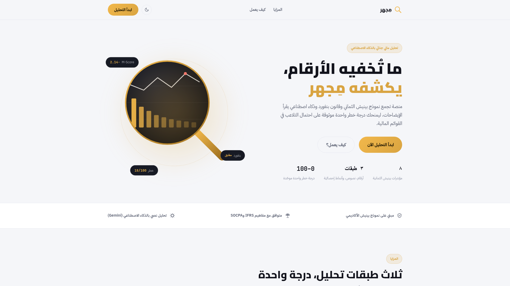

<div align="center">


# مِجهر · Mijhar

### ما تُخفيه الأرقام… يكشفه مِجهر 🔬

عدسة ذكية تفحص القوائم المالية وتكشف مؤشرات التلاعب قبل فوات الأوان

<br/>


<br/>

🌐 **جرّب الموقع مباشرة:** [mijharmvp.replit.app](https://mijharmvp.replit.app)

<br/>


&nbsp;&nbsp;&nbsp;&nbsp;&nbsp;&nbsp;


<br/><br/>



<br/>

[**( شاهد جولة كاملة في الموقع — فيديو )**](assets/demo.mp4)

</div>

---

<div dir="rtl">

<div align="center">

<h2>
<a href="#نبذة"><kbd> نبذة </kbd></a>
<a href="#المشكلة"><kbd> المشكلة </kbd></a>
<a href="#الحل"><kbd> الحل </kbd></a>
<a href="#ماذا-يقدم-الإصدار-الحالي"><kbd> الإصدار الحالي </kbd></a>
<a href="#طبقات-التحليل-الثلاث"><kbd> طبقات التحليل </kbd></a>
<a href="#درجة-الخطر"><kbd> درجة الخطر </kbd></a>
<a href="#لماذا-مجهر"><kbd> لماذا مِجهر؟ </kbd></a>
<a href="#التقنيات"><kbd> التقنيات </kbd></a>
<a href="#التشغيل-محليًا"><kbd> التشغيل </kbd></a>
<a href="#فريق-السُّلاف"><kbd> الفريق </kbd></a>

</h2>

</div>

## نبذة
**مِجهر** منصة عربية تفحص القوائم المالية وتكشف مؤشرات التلاعب المحتملة. أدخل الأرقام والإيضاحات، ويعيدها لك درجة خطر واحدة واضحة مع تفسير بالعربي — دون الحاجة لأي خلفية في التحليل المالي الجنائي.

صُمم ليخدم المراجعين والمحللين والمستثمرين وطلاب المحاسبة.

## المشكلة
اكتشاف التلاعب في القوائم المالية يتطلب خبرة تحليلية عميقة ووقتًا طويلًا، والمؤشرات الخادعة قد تمر على المراجع دون أن يلاحظها — خاصة عندما تكون مخفية في صياغات الإيضاحات لا في الأرقام نفسها.

## الحل
**مِجهر** يفحص القوائم المالية من ثلاث زوايا مختلفة في وقت واحد، ويجمع النتائج في **درجة خطر واحدة موحدة من 0 إلى 100** مع تفسير واضح بالعربي.

## ماذا يقدّم الإصدار الحالي
مِجهر نسخة تجريبية أولى تعمل فعليًا من الإدخال حتى النتيجة — ليست مجرد واجهة عرض:

- ✔️ إدخال القوائم المالية يدويًا أو ببيانات تجريبية جاهزة
- ✔️ حساب مؤشرات بينيش الثمانية ودرجة M-Score
- ✔️ فحص بنفورد الإحصائي لتوزيع الأرقام
- ✔️ قراءة الإيضاحات بالذكاء الاصطناعي مع تفسير عربي
- ✔️ درجة خطر موحدة 0–100 مع تصنيف ملوّن
- ✔️ واجهة عربية كاملة مع وضع ليلي

**في خطط التطوير القادمة:** ضبط حدود المؤشرات لتقليل الإنذارات الكاذبة، قراءة القوائم من ملفات PDF مباشرة، ومقارنة عدة سنوات مالية لنفس الشركة.

## طبقات التحليل الثلاث

| الطبقة | ماذا تفحص | كيف |
|---|---|---|
| **نموذج Beneish الثماني** | الأرقام | ثمانية مؤشرات مالية أكاديمية لكشف التلاعب بالأرباح (M-Score) |
| **قانون Benford** | الأنماط الإحصائية | مقارنة توزيع الأرقام الأولى بالتوزيع الطبيعي المتوقع |
| **الذكاء الاصطناعي (Gemini)** | النصوص | قراءة الإيضاحات لرصد الصياغات المراوغة وتغيّر السياسات المحاسبية |

## درجة الخطر

| الدرجة | المستوى | المعنى |
|---|---|---|
| 0 – 39 | 🟢 منخفضة | لا توجد مؤشرات تلاعب جوهرية |
| 40 – 69 | 🟡 متوسطة | مؤشرات تستدعي فحصًا أعمق |
| 70 – 100 | 🔴 مرتفعة | مؤشرات قوية على احتمال التلاعب |

## لماذا مِجهر؟

- **أثر حقيقي:** يختصر فحصًا يحتاج خبيرًا ماليًا وساعات من التدقيق إلى دقائق، ويجعل كشف مؤشرات التلاعب في متناول المراجع والمستثمر والجهة الرقابية.
- **عمق تقني:** ثلاث منهجيات مستقلة (أكاديمية، إحصائية، لغوية) تتقاطع نتائجها في درجة واحدة — لا اعتماد على مصدر وحيد قد يخطئ.
- **فكرة مبتكرة:** الجمع بين نموذج بينيش وقانون بنفورد وقراءة الإيضاحات بالذكاء الاصطناعي في أداة عربية واحدة.
- **قابل للنمو:** بنية بسيطة تسمح بإضافة قراءة ملفات PDF ومقارنة السنوات المالية دون إعادة بناء.
- **تجربة استخدام مدروسة:** واجهة عربية RTL كاملة، وضع ليلي، بيانات تجريبية جاهزة للتجربة بضغطة واحدة.

## التقنيات
- **الخلفية:** Python + Flask
- **الواجهة:** HTML / CSS / JavaScript (عربي RTL كامل مع وضع ليلي)
- **الذكاء الاصطناعي:** Google Gemini API
- **متوافق مع مفاهيم:** IFRS و SOCPA

## التشغيل محليًا

```bash
pip install -r requirements.txt
python server.py
```

ثم افتح `http://localhost:5000`

**ملاحظة:** تحليل بينيش وبنفورد ودرجة الخطر تعمل مباشرة دون أي إعداد إضافي. أما قسم *قراءة الإيضاحات* وحده فيحتاج مفتاح Gemini مجانيًا من [Google AI Studio](https://aistudio.google.com)، يوضع في ملف `.env`:

```
GEMINI_API_KEY=مفتاحك_هنا
```

## فريق السُّلاف

<div align="center">

**عمار السمرقندي** · **البراء سيف** · **عبدالله الغامدي** · **اجواد الحازمي** · **اصيل بادحدح**

</div>

## تنويه
مِجهر أداة استرشادية أوّلية ولا تُغني عن المراجعة البشرية أو التدقيق المهني.

</div>
